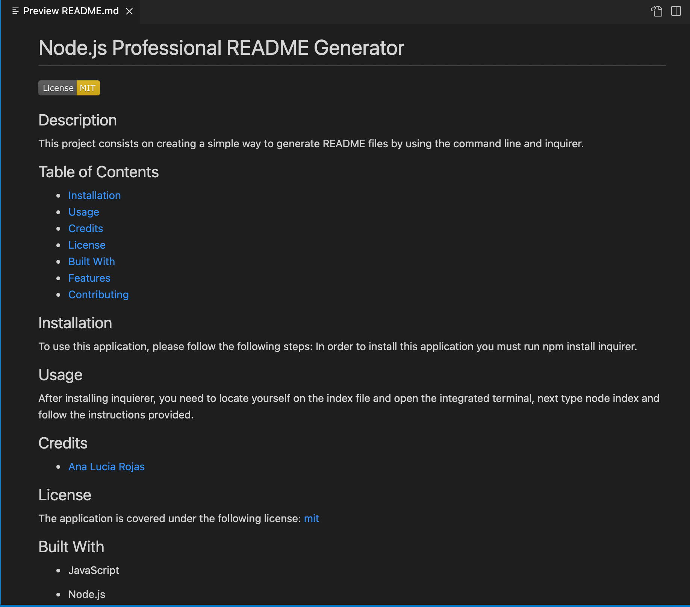

# 9.-Node.js-Challenge-Professional-README-Generator

## Description

This project consisted on creating a simple and quick way to generate a high quality README file. This is a command-line application that generates a file from a user's input using the Inquirer package. 

## Table of Contents

* [Installation](#installation)
* [Usage](#usage)
* [Snippets](#snippets)
* [Technologies](#technologies)
* [Preview](#preview)
* [Links](#links)

## Installation 

In order to use this application please install inquirer typing this into your command line. 

```  
npm install inquirer     
```  

## Usage 

After installing npm inquirer, from the index.js file use the vs code integrated termial and type node index. Enter the requiered fields and answer properly. Finally, the README.md file will be created and stored in the ./dist folder.

## Snippets 

* **Packages needed for this application**
```            
const inquirer = require('inquirer');
const fs = require('fs');
const generateMarkdown = require('./utils/generateMarkdown.js');
```   
* **Render license function in generate markdown file**
```            
const renderLicenseSection = license => {
  if (license != 'No license') {
  return `
  The application is covered under the following license:
  ${renderLicenseLink(license)}
    `;
  } else {
    return `This application has no license
`;
  }
 }
```  
* **Function that initializes application**
```            
   function init() {
    return inquirer.prompt(questions);
};

init()
    // Calls collaborator function
    .then(response => addCollaborator(response))
    .then(responsefeature => {
    // Calls feature function if you selected it on the extra sections
    if (responsefeature.contents.indexOf('Features') > -1) {
        return addFeatures(responsefeature);
    } else {
        return responsefeature;
    }
    })
    .then(answers => generateMarkdown(answers))
    .then(generatedReadme => writeToFile('README.md', generatedReadme))
    .catch(err => {
        console.log(err);
    });
```           


## Technologies

* JavaScript
* Node.js
* Inquirer

## Preview

This is a an image of a professional generated README file using this application.  




## Links

* [URL of the Youtube video](https://youtu.be/suF5AoZFQFE)

* [URL of the GitHub repository](https://github.com/analuciarojas/9.-Node.js-Challenge-Professional-README-Generator)